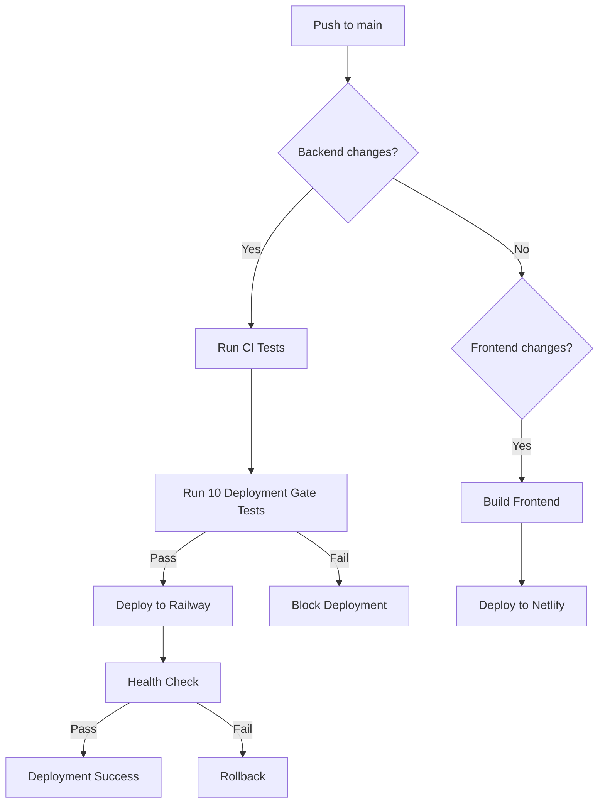

# Deployment Guide

## Overview

VoterPrime uses GitHub Actions for CI/CD with automated testing and deployment gates.

## Deployment Pipeline

### 1. **Continuous Integration** (`ci.yml`)

Runs on every PR and push to main/develop:

- ✅ Backend unit tests
- ✅ Backend integration tests (10 deployment gate tests)
- ✅ Frontend tests and build verification
- ✅ Security scanning with Trivy
- ✅ Type checking

### 2. **Backend Deployment** (`deploy-backend.yml`)

Triggered on push to main (backend changes only):

1. **Pre-Deployment Tests** (Deployment Gate)
   - Runs 10 critical category matching tests
   - Verifies environment variables
   - **Blocks deployment if any test fails**

2. **Deploy to Railway**
   - Automatic deployment via Railway CLI
   - Uses conda environment from `environment.yml`

3. **Post-Deployment Verification**
   - Health check endpoint
   - Category matching endpoint test
   - Notifies on success/failure

### 3. **Frontend Deployment** (`deploy-frontend.yml`)

Triggered on push to main (frontend changes only):

1. Run frontend tests
2. Build production bundle
3. Deploy to Netlify
4. Smoke test deployed site

## The 10 Deployment Gate Tests

These tests **must pass** before backend deployment:

1. Healthcare access query
2. Climate urgency query
3. Education funding query
4. Immigration reform query
5. Gun safety query
6. Economic inequality query
7. Voting rights query
8. Criminal justice reform query
9. Abortion rights query
10. Infrastructure investment query

Plus additional tests for:
- Confidence label updates
- Response time (< 5 seconds)
- Multiple priority handling

See `backend/tests/integration/README.md` for details.

## Required GitHub Secrets

Configure these in GitHub Settings → Secrets and variables → Actions:

### Backend Deployment
- `DATABASE_URL` - PostgreSQL connection string
- `OPENAI_API_KEY` - OpenAI API key
- `RAILWAY_TOKEN` - Railway CLI authentication token

### Frontend Deployment
- `NETLIFY_AUTH_TOKEN` - Netlify authentication token
- `NETLIFY_SITE_ID` - Netlify site ID
- `NETLIFY_SITE_URL` - Netlify site URL (for smoke tests)

## Manual Deployment

### Backend (Railway)

```bash
# Run tests first
cd backend
conda activate ai-recommendation-service
pytest tests/integration/test_category_matching_deployment.py -v

# If tests pass, deploy
git push origin main
```

### Frontend (Netlify)

```bash
# Build and test locally
cd frontend
npm run build
npm test

# Deploy
git push origin main
```

## Deployment Workflow



## Rollback Procedure

If deployment fails:

1. **Railway** - Automatically reverts to previous deployment
2. **Check logs** - Railway dashboard or GitHub Actions
3. **Fix issue** - Address failing tests
4. **Redeploy** - Push fix to main

## Monitoring

- **Railway Logs**: https://railway.app
- **GitHub Actions**: Repository → Actions tab
- **Health Endpoint**: https://voter-mambo-production.up.railway.app/health
- **Cost Dashboard**: https://voter-mambo-production.up.railway.app/admin/cost-dashboard

## Best Practices

1. **Always run tests locally** before pushing
2. **Use conventional commits** for automatic versioning
3. **Review CI results** before merging PRs
4. **Monitor deployment logs** after push to main
5. **Test in production** after deployment completes

## Troubleshooting

### Tests fail locally but pass in CI
- Check environment variables
- Verify conda environment is activated
- Ensure database is accessible

### Deployment blocked by gate tests
- Review test output in GitHub Actions
- Fix category matching issues
- Verify OpenAI API is working
- Re-run tests locally

### Railway deployment fails
- Check Railway logs
- Verify environment variables in Railway dashboard
- Check database connectivity
- Review `environment.yml` for dependency issues

### Frontend deployment fails
- Check build logs
- Verify environment variables in Netlify
- Check backend URL is correct
- Review Netlify deploy logs
